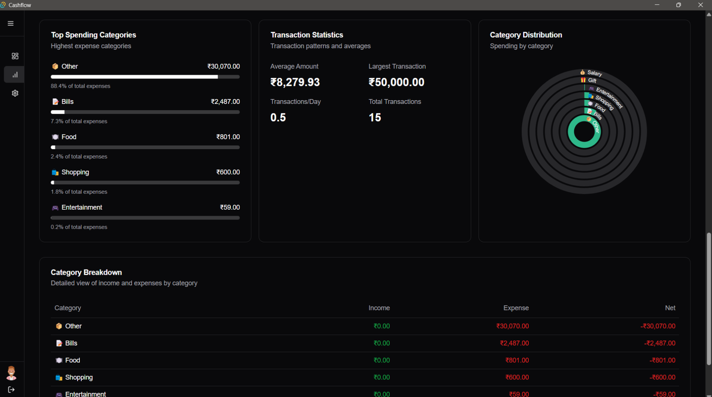

# Cashflow

A privacy-focused, self-hostable expense tracking desktop application built with Tauri, NextJS, TypeScript, and Firebase. Cashflow empowers users to manage finances across multiple spaces while giving them full control of their data by utilizing their own Firebase account.



## Features

-   **Multi-Space Management**: Organize finances into independent spaces.
-   **Full Data Ownership**: Users provide their own Firebase credentials, ensuring complete control over their data.
-   **Customizable**: Personalized settings and categories for each space.
-   **Secure and Private**: No analytics tracking or third-party dependencies beyond Firebase.

## Installation

### Option 1: Download from Releases

1. Visit the [Releases](https://github.com/d3oxy/cashflow/releases) page.
2. Download the latest version for your operating system.
3. Extract and run the application.
4. On the first launch:
    - Provide your Firebase project credentials directly in the setup UI.
    - Create your first user account to start managing finances.

### Option 2: Build from Source

1. Clone the repository:
    ```bash
    git clone https://github.com/d3oxy/cashflow.git
    cd cashflow
    ```
2. Install dependencies:
    ```bash
    pnpm install
    ```
3. Build and run:
    ```bash
    pnpm tauri dev
    ```
4. On launching the app, add your Firebase credentials directly via the setup UI.
5. For production builds:
    ```bash
    pnpm tauri build
    ```

## Usage

1. Launch the app.
2. Provide Firebase credentials (API Key, Project ID, etc.) in the setup wizard when prompted.
3. Create a user account to start using the app.
4. Add spaces and transactions to organize your finances.

## Firebase Security Rules

As part of the setup, use the provided Firestore rules file (`firestorerule.txt`) to configure your Firestore database. These rules ensure basic security for your data. To apply them:

1. Open the Firebase Console.
2. Navigate to the **Firestore Database** section.
3. Go to **Rules** and replace the existing rules with the contents of `firestorerule.txt`.

### Important Notes:

-   The provided rules are basic and might have vulnerabilities. Users are encouraged to customize and enhance the rules for added security.
-   As an additional security layer, since Firebase environment values are not shared publicly, unauthorized access to your Firestore database is significantly minimized.

## Development

### Prerequisites

-   **Node.js**
-   **pnpm**
-   **Firebase Project**

### Development Workflow

1. Start the development server:
    ```bash
    pnpm tauri dev
    ```
2. Make changes and test locally.
3. Build for production:
    ```bash
    pnpm tauri build
    ```

### Code Style Guidelines

-   Follow TypeScript best practices.
-   Maintain consistent file structure.
-   Use descriptive commit messages.

## Contribution Guidelines

1. Fork the repository.
2. Create a new branch for your feature/bug fix.
3. Submit a pull request.
